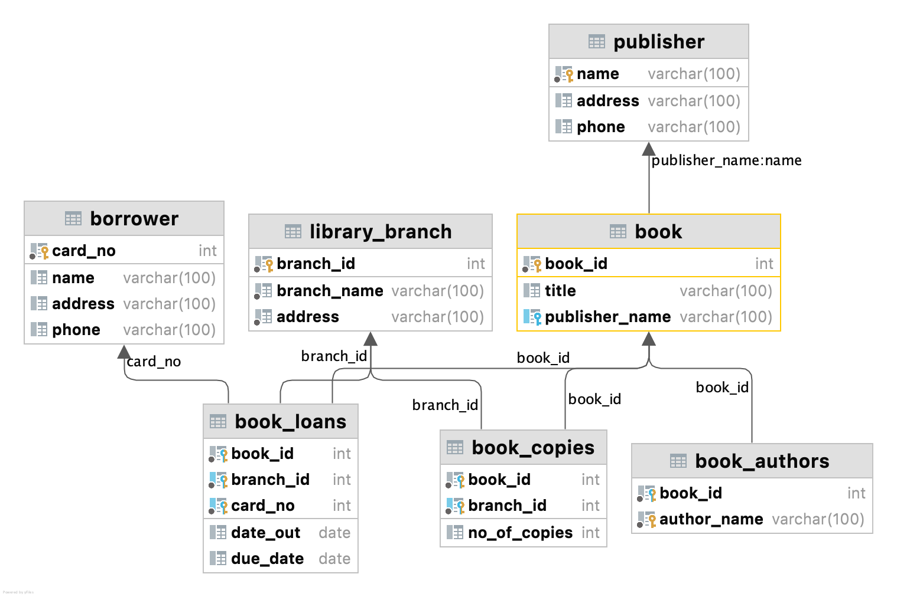
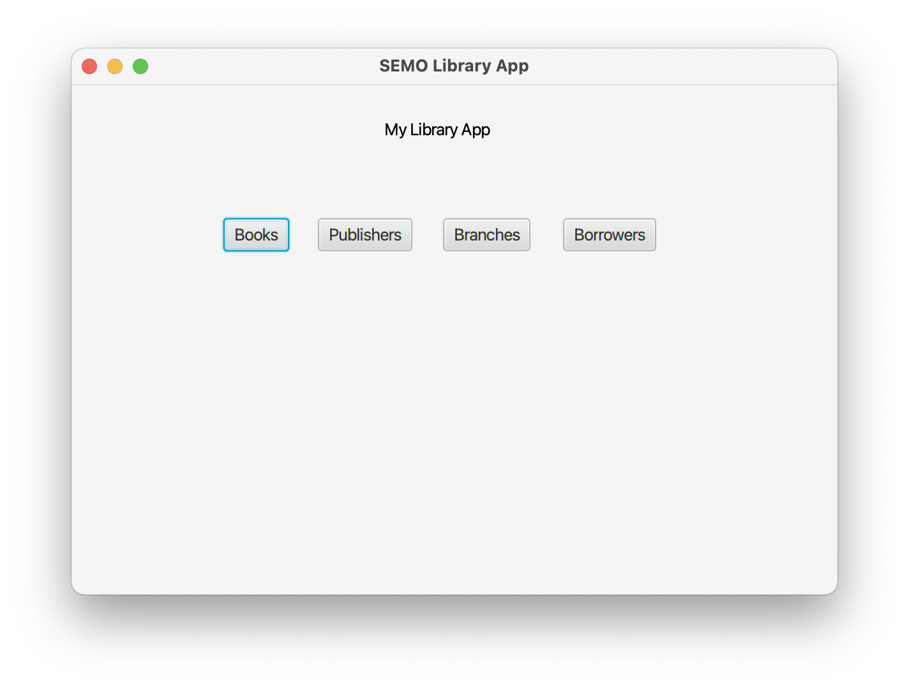
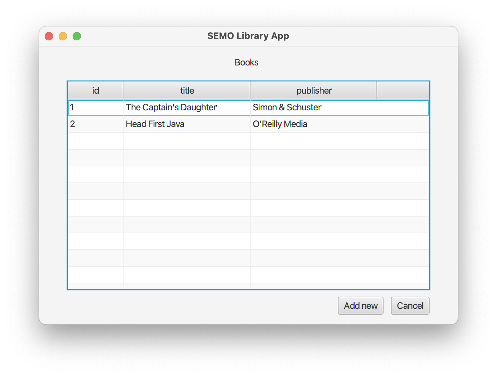
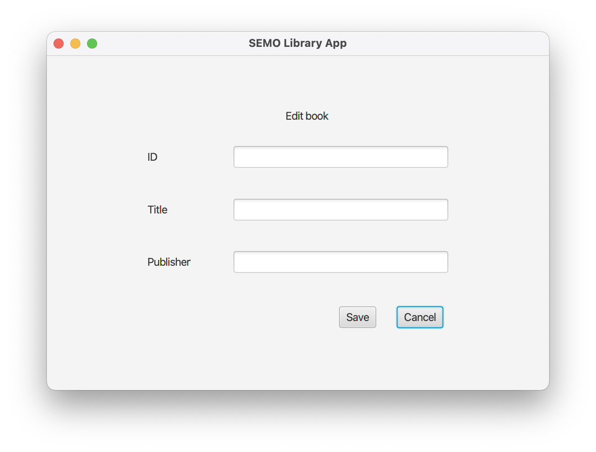
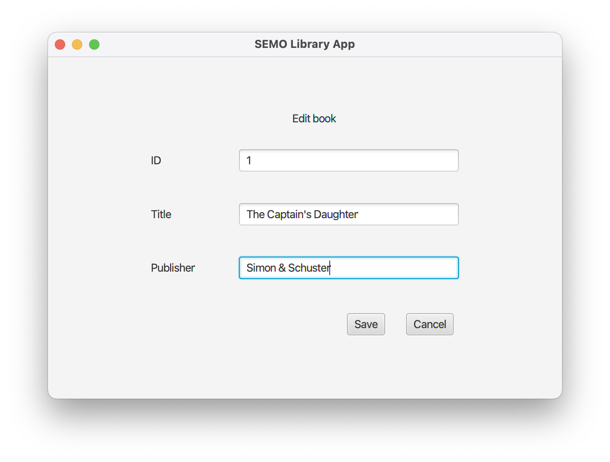

# Desktop Library Management App (LMA)

Built with:

- Java
- JavaFX
- SceneBuilder
- MySQL
- Maven
- Lombok
- Docker

## Features

- List all branch names and their addresses.
- List the complete information of all publishers.
- List all borrower names, addresses and their phone numbers.
- List all book titles and their authors.
- List the names and how many copies are there of the following book with id: 232323.

## Database Schema

## Screens

## Resources

- https://code.makery.ch/library/javafx-tutorial/
